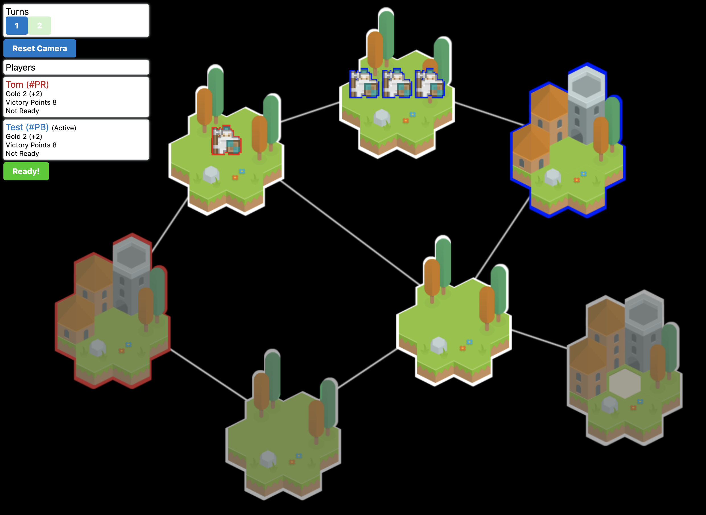
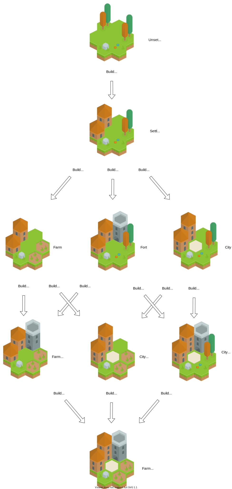
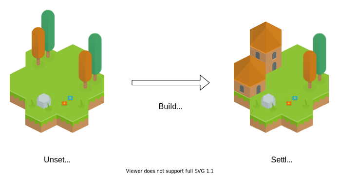
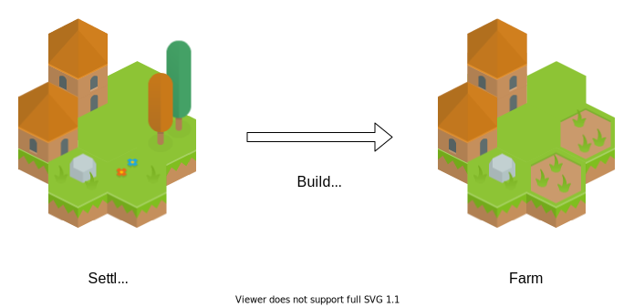
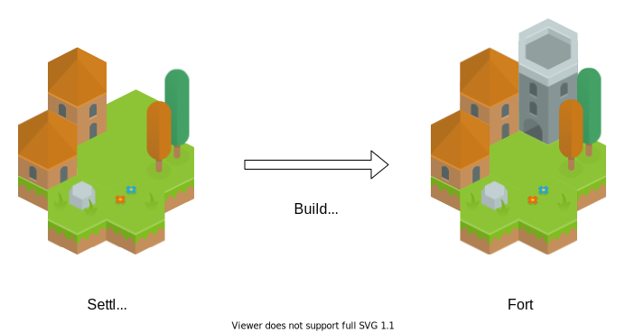
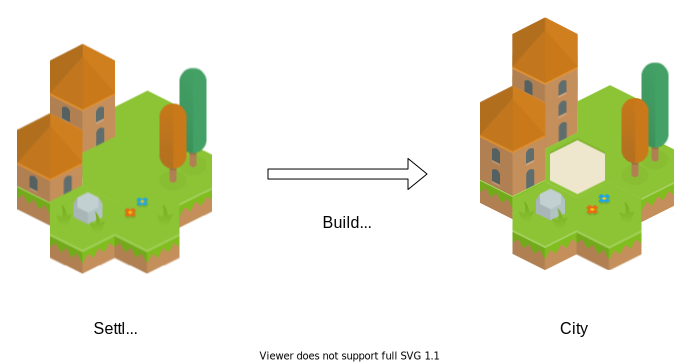

# Game Manual

- [1 Introduction](#1-introduction)
- [2 Game Concepts](#2-game-concepts)
- [3 Resolving a Turn](#3-resolving-a-turn)
- [4 Territory Actions](#4-territory-actions)
- [5 Combat](#5-combat)

## 1 Introduction

This is a turn-based strategy game about capturing the territories of opponents and defeating their units in strategic combat. To win the game, a player must:

- earn Victory Points equal to or greater than the Victory Point limit,
- have the most Victory Points at the end of the game, or,
- capture all territories and defeat all opposing units

To play the game, each [Player](#players) simultaneously issues Actions to the [Units](#units) and [Territories](#territories) they control. These Actions are hidden from other Players. When all Players have issued their Actions for the current Turn and indicated they are ready, then the next Turn is resolved by applying all the Actions to advance the state of the [Map](#map).

## 2 Game Concepts

This chapter describes the elements of the game and how they relate to one another.

### Game

The **Game** consists of:

- A series of [Maps](#map) that describe the state of the game at each [Turn](#turns). Advancing the state of the game and producing a new [Map](#map) is called ["Resolving a Turn"](#3-resolving-a-turn).
- The [Players](#players) that compete within the game.
- A maximum number of [Victory Points](#victory-points). If a player (or players) reach this number of Victory Points then they are declared the winner (or winners) of the Game.
- A maximum number of [Turns](#turns). Once this number of Turns has resolved without a winner by other conditions then the Game ends with the winner declared as the Player (or Players) with the most Victory Points.

### Map

> The **Map** captures the state of the **Game** for a **Turn**.

- The [Territories](#territories) that exist and how they are connected to allow [Units](#units) to move between them
- The [Players](#players) control [Territories](#territories) and [Units](#units) within the [Map](#map)

### Turns

> **Turns** are the steps of the game when **Players** issue Actions.

- For each [Turn](#turn) the state of the game is captured as a [Map](#map)
- In each [Turn](#turn) the [Players](#players) issues Actions to the [Units](#units) and [Territories](#territories) they control. These Actions influence how the [turn will resolve](#3-resolving-a-turn) to produce the new [Map](#map).

### Players

> **Players** represent the people playing in competition to win the [Game](#game).

- Players assign Actions to [Units](#units) and [Territories](#territories)
- Players collect [Victory Points](#victory-points)
- Players collect [Gold](#gold)

### Gold

> **Gold** is collected by [Players](#players) to pay for [Territory Actions](#4-territory-actions).

Uses:

- Pay for [Territory Actions](#4-territory-actions) on [Territories](#territories), and
- Contribute to [Victory Points](#victory-points).

[Players](#players) collect [Gold](#gold) from the [Territories](#territories) they control. Gold is collected each [Turn](#turn). The [Gold](#gold) produced from each Territory depends on the [Territory Actions](#4-territory-actions) that have been purchased for it (e.g. `Build City` add `+1 Gold` per Turn).

### Victory Points

> **Victory Points** are collected by [Players](#players) in order to win the game. 

- If a Player (or Players) reach the maximum Victory Points for the [Game] then those Players win. Otherwise, 
- When the maximum Turns have resolved, the Player(s) with the most Victory Points following that final Turn are declared the winners.

The current Victory Points for a Player are calculated each Turn using the following formula:

- Each [Unit](#units) and [Territory](#territories) currently controlled adds _1 Victory Point_
- Each upgrade on controlled Territories adds _1 Victory Point_
- Each _1 Gold_ held adds _1 Victory Point_
- Over the course of the game, each opposing Unit defeated and each neutral Territory captured adds _1 Victory Point_
- Over the course of the game, each opposing Territory captured adds _2 Victory Points_

### Territories

> **Territories** are the interconnected nodes of the [Map](#map). [Units](#units) move between [Territories](#territories) and capture them for their [Player](#players).

[Players](#players) issue [Territory Actions](#4-territory-actions) to the [Territories](#territories) they control to upgrade the territory or to produce new [Units](#units). [Players](#players) pay [Gold](#gold) and [Food](#food) to issue [Territory Actions](#4-territory-actions).

### Food

> **Food** is produced by [Territories](#territories). It is used to feed [Units](#units) and pay for [Territory Actions](#4-territory-actions).

Food is produced by [Territories](#territories) each turn. The Food produced by a [Territory](#territories) is local to that Territory and accumulates up to the Territory's Food Stockpile limit. The production rate and limit of the Territory are affected by the [Upgrades](#4-territory-actions) that apply to the Territory.

Units consume [Food](#food) from their current [Territory](#territories) each [Turn](#turns).

### Units

> **Units** move between **Territories** and engage in [Combat](#5-combat) over control of them.

Units are issued a "Move" Action by their [Player](#player) to move to an adjacent [Territory](#territories) when the [turn is resolved](#3-resolving-a-turn).

Units consume 1 [Food](#food) from their current [Territory](#territories) each [Turn](#turns). If the required [Food](#food) isn't available, the Unit gets the "Starving" status that makes it less effective in [Combat](#5-combat).

## 3 Resolving a Turn

This chapter describes how each [Turn](#turns) state of a [Map](#map) resolves to produce a new [Map](#map). Resolving a [Turn](#turns) proceeds as a series of steps.

### Move Units

[Units](#units) that have been issued a `Move` Action move to the selected [Territory](#territories). Any Unit with the `Defending` status loses it as part of their move.

Units move first to the space between [Territories](#territories), then any [Combats](#5-combat) that have occurred are resolved. Then remaining Units complete their moves, and any final Combats are resolved.

### Resolve Combats

[Combats](#5-combat) are resolved whenever any moving [Units](#units) end up in the same location.

### Add `Defending`

Any [Units](#units) that were not issued a `Move` Action as part of this turn receive the `Defending` status.

### Resolve Food

[Food](#food) is produced by each [Territory](#territories). The [Units](#units) on each Territory also consume `1 Food` each, simultaneously. Food produced this turn that is not consumed by the Units is added to the Food Stockpile for the Territory, up to the limit for that Territory.

If there is not enough Food on the Territory (including the Food produced this Turn) to feed all the [Units], then any unfed Units receive the `Starving` status. And fed Unit that had the `Starving` status loses it.

### Resolve Gold

[Gold](#gold) is produced by each [Territory](#territories) and added to the Gold total of the controlling [Player](#players).

### Territory Capture

For each [Territory](#territories), a [Player](#players) captures it and gains control of it if they meet the following conditions:

- The Territory contained only Units controlled by that Player at the last turn
- The Territory contains only Units controlled by that Player now
- The Territory is not already controlled by that Player

Territory Captures are recorded and contribute to [Victory Points](#victory-points).

When a Territory is captured, any pending Territory Action on that Territory is removed. The cost of the Territory Action is not refunded.

### Territory Actions

For each [Territory](#territories), any pending Territory Action is resolved. 

## 4 Territory Actions

This chapter describes the **Territory Actions** that [Players](#players) can issue to the [Territories](#territories) they control as part of planning each [Turn](#turns).

Most Territory Actions apply an Upgrade to the [Territory](#territories) that changes the characteristics of the Territory and unlocks new Territory Actions.

## Before any Territory Actions

[Territories](#territories) have the following base characteristics:

- [Territories](#territories) produce `0` [Gold](#gold).
- [Territories](#territories) produce `1` [Food](#food) and have a [Food Stockpile](#food) limit of `3`.

## Build Settlement

**Costs:** _Build Settlement_ costs `0 Food` and `3 Gold`.

**Requires:** nothing.

_Build Settlement_ does the following:

- Adds the `Settled` property to the [Territory](#territory)
- Adds `+1` [Gold](#gold) production
- Sets a [Food Stockpile](#food) limit of `5`.

## Build Farm

**Costs:** _Build Farm_ costs `1 Food` and `1 Gold`.

**Requires:** the Territory has the `Settled` property.

_Build Farm_ does the following:

- Adds the `Farm` property to the [Territory](#territory)
- Adds `+1` [Food](#food) production
- Sets a [Food Stockpile](#food) limit of `7`.

## Build Fort

**Costs:** _Build Fort_ costs `2 Food` and `5 Gold`.

**Requires:** the Territory has the `Fort` property.

_Build Fort_ does the following:

- Adds the `Fort` property to the [Territory](#territory)
- Allows the `Create Unit` Territory Action

## Build City

**Costs:** _Build City_ costs `2 Food` and `5 Gold`.

**Requires:** the Territory has the `Settled` property.

_Build City_ does the following:

- Adds the `City` property to the [Territory](#territory)
- Adds `+1` [Gold](#gold) production

## Build Castle

**Costs:** _Build Castle_ costs `3 Food` and `10 Gold`.

**Requires:** the Territory has the `City`, `Farm`, and `Fort` properties.

_Build Castle_ does the following:

- Adds the `Castle` property to the [Territory](#territory).
- Sets a [Food Stockpile](#food) limit of `10`.

## Create Unit

**Costs:** _Create Unit_ costs `3 Food` and `0 Gold`.

**Requires:** the Territory has the `Fort` property.

## 5 Combat

Combat occurs when a location is occupied by [Units](#units) from two or more [Players](#players). This location can be a [Territory](#territories) or in the space between two adjacent Territories.

#### Combat Rating

Each [Player](#players) in a Combat is assigned a Combat Rating based on the [Units](#units) they have present. 

| Condition | Combat Rating |
| --------- | ------------- |
| Each Unit | +2 points      |
| Each `Defending` status amongst Units | +1 point |
| Each `Starving` status amongst Units | -1 point |

#### Retaining Units

The [Player](#players) with the highest Combat Rating wins the Combat and retains [Units](#units) according to the margin by which they won.

| Player A | Player B | Difference in Combat Rating | Player A retains... |
| -------- | -------- | --------------------------- | ------------------- |
| 4        | 4        | 0                           | 0 units             |
| 5        | 4        | 1                           | 1 unit              |
| 6        | 4        | 2                           | 1 unit              |
| 7        | 4        | 3                           | 2 unit              |
| 8        | 4        | 4                           | 2 unit              |
| 9        | 4        | 5                           | 3 unit              |

> **NOTE** Currently there is no deterministic rule as to which units are retained.